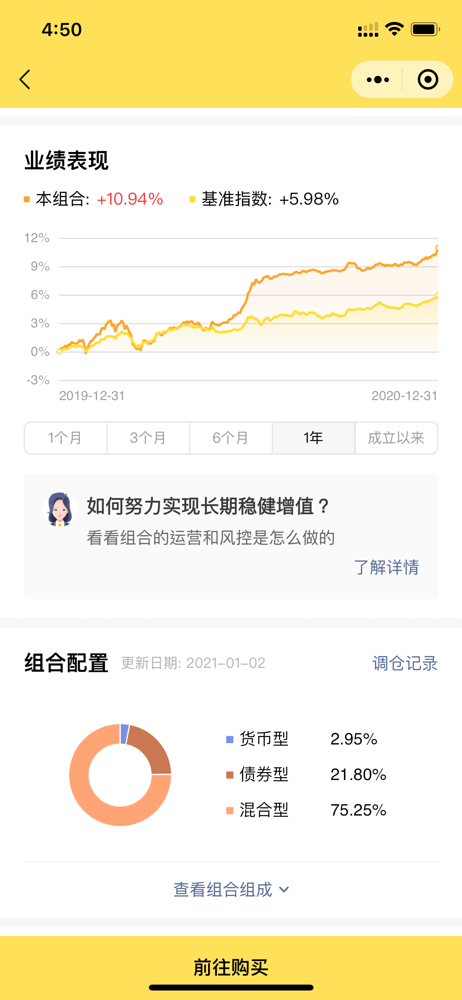
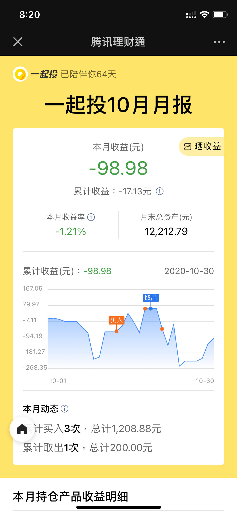
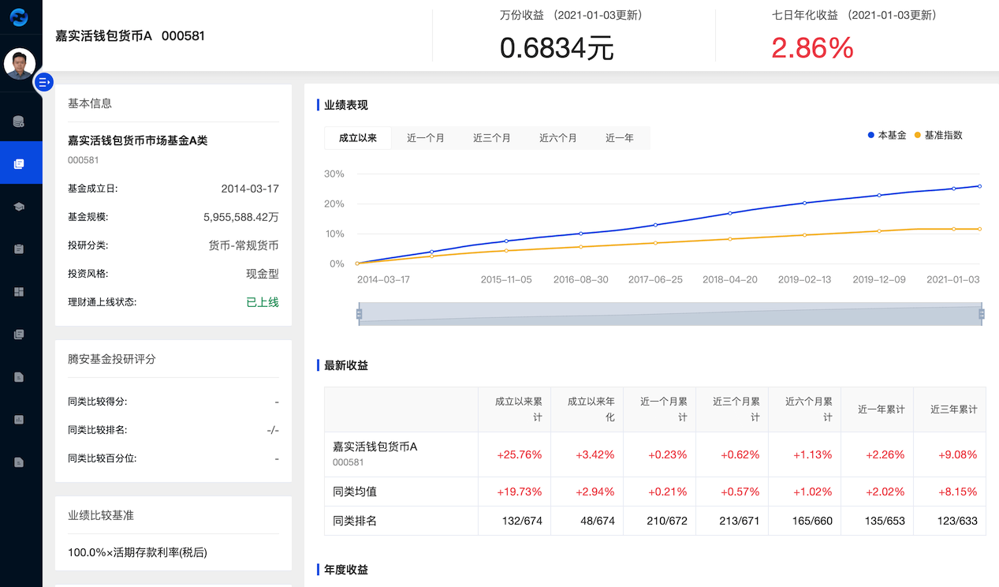

騰訊職業期間，開發的產品是圍繞微信場景的應用

## 一起投

### 微信小程序

    <figure itemprop="associatedMedia" itemscope itemtype="http://schema.org/ImageObject">
        
    </figure>
    <figure itemprop="associatedMedia" itemscope itemtype="http://schema.org/ImageObject">
        
    </figure>
    <figure itemprop="associatedMedia" itemscope itemtype="http://schema.org/ImageObject">
        
    </figure>
    <figure itemprop="associatedMedia" itemscope itemtype="http://schema.org/ImageObject">
        
    </figure>
    <figure itemprop="associatedMedia" itemscope itemtype="http://schema.org/ImageObject">
        
    </figure>



微信掃 QR code 體驗

### 微信內嵌 webview

    <figure itemprop="associatedMedia" itemscope itemtype="http://schema.org/ImageObject">
        
    </figure>
    <figure itemprop="associatedMedia" itemscope itemtype="http://schema.org/ImageObject">
        
    </figure>
    <figure itemprop="associatedMedia" itemscope itemtype="http://schema.org/ImageObject">
        
    </figure>



掃 QR code 體驗

### 營銷活動
### 中秋節

    

    

        

            

            

            

        

        

            

                

                

                    

                      

                        

                      

                    

                

            

            

                

            

            <button class="pswp__button pswp__button--arrow--left" title="Previous (arrow left)">
            </button>
            <button class="pswp__button pswp__button--arrow--right" title="Next (arrow right)">
            </button>
            

                

            

        

    

#### 感恩節

    

    

        

            

            

            

        

        <!-- Default (PhotoSwipeUI_Default) interface on top of sliding area. Can be changed. -->
        

            

                <!--  Controls are self-explanatory. Order can be changed. -->
                

                <!-- <button class="pswp__button pswp__button--fs" title="Toggle fullscreen"></button>
                <button class="pswp__button pswp__button--zoom" title="Zoom in/out"></button> -->
                <!-- Preloader demo https://codepen.io/dimsemenov/pen/yyBWoR -->
                <!-- element will get class pswp__preloader--active when preloader is running -->
                

                    

                      

                        

                      

                    

                

            

            

                

            

            <button class="pswp__button pswp__button--arrow--left" title="Previous (arrow left)">
            </button>
            <button class="pswp__button pswp__button--arrow--right" title="Next (arrow right)">
            </button>
            

                

            

        

    

## 資產管理平台 (基金機構端)

    <figure itemprop="associatedMedia" itemscope itemtype="http://schema.org/ImageObject">
        
    </figure>
    <figure itemprop="associatedMedia" itemscope itemtype="http://schema.org/ImageObject">
        
    </figure>
    <figure itemprop="associatedMedia" itemscope itemtype="http://schema.org/ImageObject">
        
    </figure>

