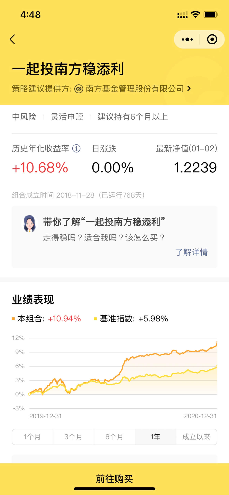
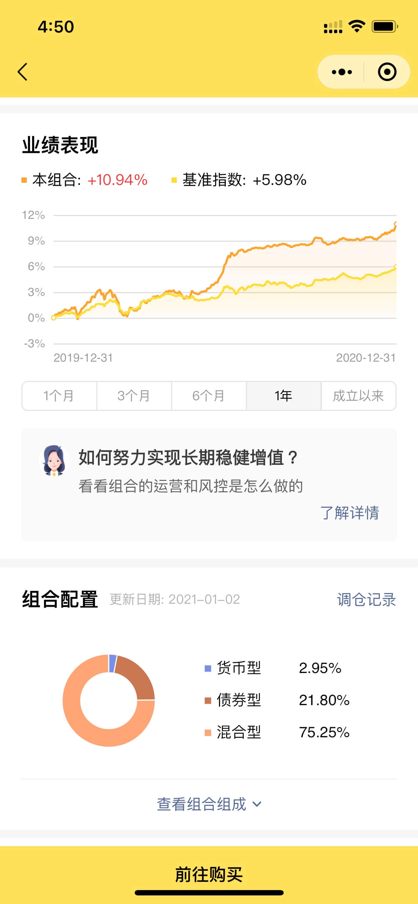
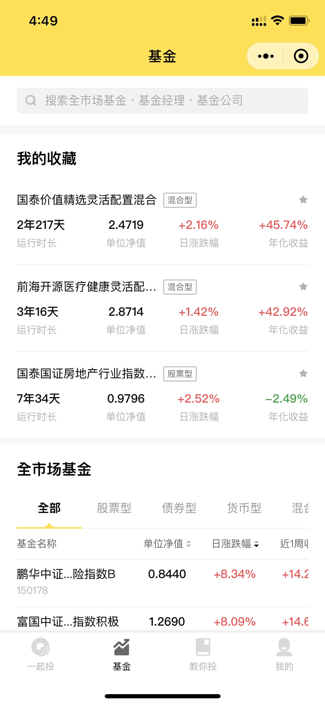
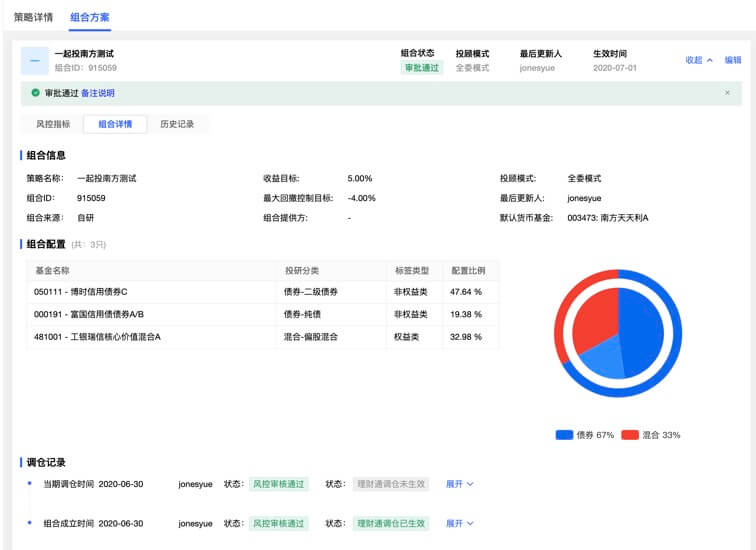
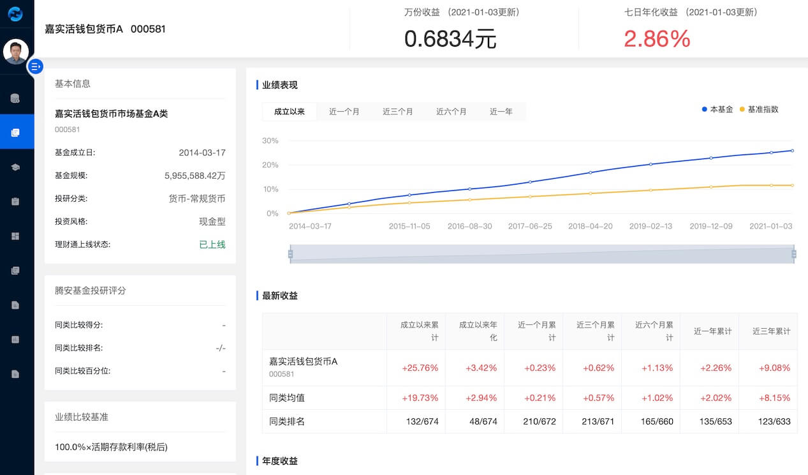
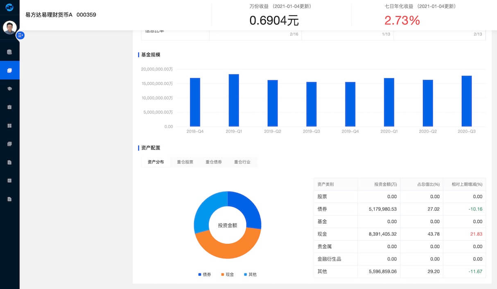

於騰訊 CDG 金融科技中心擔任前端工程師期間，開發的產品圍繞微信支付相關應用

<h2 id="fund-portfolio-investment">基金組合投資平台（一起投）</h2>

### 微信小程序

    <figure itemprop="associatedMedia" itemscope itemtype="http://schema.org/ImageObject">
        
    </figure>
    <figure itemprop="associatedMedia" itemscope itemtype="http://schema.org/ImageObject">
        
    </figure>
    <figure itemprop="associatedMedia" itemscope itemtype="http://schema.org/ImageObject">
        
    </figure>
    <figure itemprop="associatedMedia" itemscope itemtype="http://schema.org/ImageObject">
        
    </figure>
    <figure itemprop="associatedMedia" itemscope itemtype="http://schema.org/ImageObject">
        
    </figure>



微信掃 QR code 體驗

### 微信 Mobile App

    <figure itemprop="associatedMedia" itemscope itemtype="http://schema.org/ImageObject">
        
    </figure>
    <figure itemprop="associatedMedia" itemscope itemtype="http://schema.org/ImageObject">
        
    </figure>
    <figure itemprop="associatedMedia" itemscope itemtype="http://schema.org/ImageObject">
        
    </figure>



#### 掃 QR code 體驗

### 行銷活動

#### 中秋節

    

    

        

            

            

            

        

        

            

                

                

                    

                      

                        

                      

                    

                

            

            

                

            

            <button class="pswp__button pswp__button--arrow--left" title="Previous (arrow left)">
            </button>
            <button class="pswp__button pswp__button--arrow--right" title="Next (arrow right)">
            </button>
            

                

            

        

    

#### 感恩節

    

    

        

            

            

            

        

        <!-- Default (PhotoSwipeUI_Default) interface on top of sliding area. Can be changed. -->
        

            

                <!--  Controls are self-explanatory. Order can be changed. -->
                

                <!-- <button class="pswp__button pswp__button--fs" title="Toggle fullscreen"></button>
                <button class="pswp__button pswp__button--zoom" title="Zoom in/out"></button> -->
                <!-- Preloader demo https://codepen.io/dimsemenov/pen/yyBWoR -->
                <!-- element will get class pswp__preloader--active when preloader is running -->
                

                    

                      

                        

                      

                    

                

            

            

                

            

            <button class="pswp__button pswp__button--arrow--left" title="Previous (arrow left)">
            </button>
            <button class="pswp__button pswp__button--arrow--right" title="Next (arrow right)">
            </button>
            

                

            

        

    

<h2 id="fund-asset-management-system">基金資產管理系統</h2>

    <figure itemprop="associatedMedia" itemscope itemtype="http://schema.org/ImageObject">
        
    </figure>
    <figure itemprop="associatedMedia" itemscope itemtype="http://schema.org/ImageObject">
        
    </figure>
    <figure itemprop="associatedMedia" itemscope itemtype="http://schema.org/ImageObject">
        
    </figure>



<h2 id="gold-investment">黃金投資（微黃金）</h2>

### 微信小程序

    

    

        

            

            

            

        

        

            

                

                

                    

                      

                        

                      

                    

                

            

            

                

            

            <button class="pswp__button pswp__button--arrow--left" title="Previous (arrow left)">
            </button>
            <button class="pswp__button pswp__button--arrow--right" title="Next (arrow right)">
            </button>
            

                

            

        

    

### 微信掃 QR code 體驗

<h2 id="tencent-co-branded-credit-card">騰訊聯名信用卡</h2>

### 產品官網

    <figure itemprop="associatedMedia" itemscope itemtype="http://schema.org/ImageObject">
        <figcaption>響應式移動端</figcaption>
        
    </figure>
    <figure itemprop="associatedMedia" itemscope itemtype="http://schema.org/ImageObject">
        <figcaption>響應式桌面端</figcaption>
        
    </figure>



#### 體驗連結

[https://wepluscard.qq.com/mdft/index.shtml](https://wepluscard.qq.com/mdft/index.shtml)

### 行銷活動

    

    

        

            

            

            

        

        

            

                

                

                    

                      

                        

                      

                    

                

            

            

                

            

            <button class="pswp__button pswp__button--arrow--left" title="Previous (arrow left)">
            </button>
            <button class="pswp__button pswp__button--arrow--right" title="Next (arrow right)">
            </button>
            

                

            

        

    

